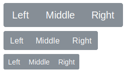

# Grupos de botones

Podemos crear un grupo de botones en una línea agrupándolos dentro de un elemento contenedor con la etiqueta `.btn-group`.

```html
<div class="btn-group" role="group" aria-label="Basic example">
  <button type="button" class="btn btn-secondary">Left</button>
  <button type="button" class="btn btn-secondary">Middle</button>
  <button type="button" class="btn btn-secondary">Right</button>
</div>
```

Con lo que obtendríamos el siguiente resultado:


> Los atributos "`role`" que utiliza Bootstrap provienen también de HTML 5 ARIA y sirven para indicar el rol o función de un elemento, en este caso se indica la agrupación de los botones.

Mediante la librería JavaScript de Bootstrap podemos añadir comportamientos tipo _checkbox_ o _radio button_ a un grupo de botones, para que al pulsarlos se quede marcados. Para más información consultad la documentación oficial.

## Barra de botones

La barra de botones nos permite combinar grupos de botones para crear componentes más avanzados:

```html
<div class="btn-toolbar" role="toolbar" aria-label="Toolbar with button groups">
  <div class="btn-group mr-2" role="group" aria-label="First group">
    <button type="button" class="btn btn-secondary">1</button>
    <button type="button" class="btn btn-secondary">2</button>
    <button type="button" class="btn btn-secondary">3</button>
    <button type="button" class="btn btn-secondary">4</button>
  </div>
  <div class="btn-group mr-2" role="group" aria-label="Second group">
    <button type="button" class="btn btn-secondary">5</button>
    <button type="button" class="btn btn-secondary">6</button>
    <button type="button" class="btn btn-secondary">7</button>
  </div>
  <div class="btn-group" role="group" aria-label="Third group">
    <button type="button" class="btn btn-secondary">8</button>
  </div>
</div>
```

Con lo que obtendríamos el siguiente resultado:


## Tamaños de los grupos de botones

Los grupos de botones también nos permiten indicar el tamaño de los botones que contienen mediante las etiquetas `.btn-group-*`, donde "\*" puede ser "`sm`" o "`lg`", por ejemplo:

```html
<div class="btn-group btn-group-lg" role="group" aria-label="...">...</div>
<div class="btn-group" role="group" aria-label="...">...</div>
<div class="btn-group btn-group-sm" role="group" aria-label="...">...</div>
```

Con lo que podríamos obtener grupos de botones de diferentes tamaños:



## Grupo de botones con desplegables

También es posible añadir desplegables a los grupos de botones. Para esto el desplegable tendrá que estar contenido a su vez dentro de otro grupo de botones, de la forma:

```html
<div class="btn-group" role="group" aria-label="Button group with nested dropdown">
  <button type="button" class="btn btn-secondary">1</button>
  <button type="button" class="btn btn-secondary">2</button>

  <div class="btn-group" role="group">
    <button id="btnGroupDrop1" type="button" class="btn btn-secondary dropdown-toggle" data-bs-toggle="dropdown" aria-haspopup="true" aria-expanded="false">
      Dropdown
    </button>
    <div class="dropdown-menu" aria-labelledby="btnGroupDrop1">
      <a class="dropdown-item" href="#">Dropdown link</a>
      <a class="dropdown-item" href="#">Dropdown link</a>
    </div>
  </div>
</div>
```

El resultado visual obtenido sería el siguiente:


Como se puede observar en el código de ejemplo anterior, la única diferencia con un desplegable normal es que la etiqueta contenedora en vez de ser de tipo `.dropdown` es un `.btn-group`.

