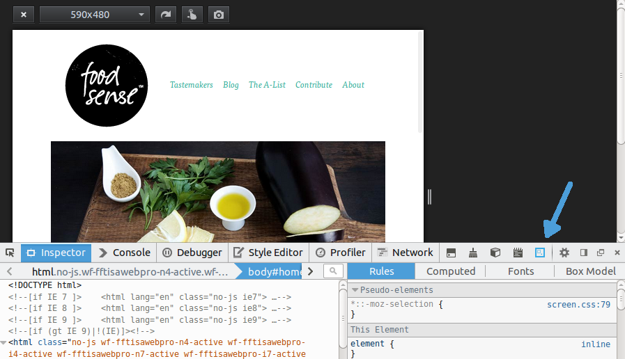

# Probando el responsive

Para probar nuestros diseños _responsive_ tenemos varias opciones, una de ellas es usar algunas de las webs que existen para tal fin. Como por ejemplo:

**Responsinator** ([http://www.responsinator.com](http://www.responsinator.com))

Esta herramienta está disponible solamente de forma _online_, pero nos permite ver de un solo vistazo como se mostraría nuestra web con el tamaño de los _smarthones_ y _tablets_ más populares, como por ejemplo las diferentes versiones de iPhone, iPad, Kindle y algunas versiones de teléfonos Android.

El problema de estas herramientas es que tenemos que acceder a una versión publicada de nuestra web (no permiten localhost) y son un poco más lentas para realizar pruebas continuas, por esta razón es mucho más recomendable utilizar alguno de los kits de herramientas para el desarrollador web que existen para los diferentes navegadores.

## Herramientas del navegador para el desarrollador

Tanto en Firefox como Chrome viene instalado por defecto una serie de herramientas de ayuda para el desarrollador que nos permiten, entre otras cosas, ver la consola de mensajes, inspeccionar el código o ver la secuencia de llamadas al servidor.

Además de estas también existen otras herramientas más avanzadas que podemos instalar como una extensión de nuestro navegador, como por ejemplo Firebug.

La ventaja de estas herramientas frente a las anteriores es que son muchos más rápidas, nos permiten probar nuestra página en local y además podemos inspeccionar el código y modificar los estilos en tiempo real. Usando el inspector de estas herramientas nos podemos ahorrar mucho tiempo a la hora de realizar pruebas sobre la propia página cargada, ya que de otra forma tendríamos que modificar el código directamente, recargar la página y volver a probarlo.

